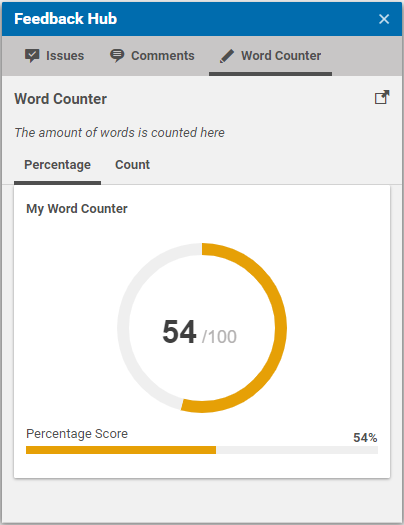

# Custom FeedbackItems

This sections describes how to implement a custom `FeedbackItem`.
To keep the example simple, we create a new `FeedbackItem` that allows us 
to render text with a cursive font.

## Java Implementation

All you have to do, is to implement the interface `FeedbackItem` for this:

```java
public class RecursiveTextFeedbackItem implements FeedbackItem {

  private String text;
  private String collection;

  public RecursiveTextFeedbackItem(String collection, String text) {
    this.collection = collection;
    this.text = text;
  }
  
  public RecursiveTextFeedbackItem(String text) {
    this(null, text);
  }

  public String getText() {
    return text;
  }

  @Override
  public String getCollection() {
    return collection;
  }

  @Override
  public String getType() {
    return "cursiveText";
  }
}
```

The interface does not require the implementation of any methods, however you can
override the `getType` method to have a simpler type name than the actual class name.
Also, you can provide the possibility to add the `FeedbackItem` to a specific collection
by overriding the `getCollection` method.

Within your provider or adapter, you can create a new `RecursiveTextFeedbackItem` 
with the text you want to render:

```java
RecursiveTextFeedbackItem myItem = new RecursiveTextFeedbackItem("header", 
  "The amount of words is counted here");
```

To make this example more interesting, you add the text to the reserved collection `header`, 
which means that it will be rendered immediately after the title and before the sub tabs.

## AS/MXML Implementation

On the client site, you have to implement the component, which should render
the new `FeedbackItem` type.

First, you have to implement a sub-component of class `FeedbackItemPanel`:

```xml
<?xml version="1.0" encoding="UTF-8"?>
<feedbackhub:FeedbackItemPanel xmlns:fx="http://ns.adobe.com/mxml/2009"
                               xmlns="exml:ext.config"
                               xmlns:exml="http://www.jangaroo.net/exml/0.8"
                               xmlns:feedbackhub="exml:com.coremedia.cms.studio.feedbackhub.config">
  <fx:Metadata>
    [ResourceBundle('com.coremedia.cms.studio.feedbackhub.FeedbackHub')]
  </fx:Metadata>
  <fx:Script><![CDATA[
    import com.coremedia.ui.skins.DisplayFieldSkin;

    public static const xtype:String = "com.coremedia.cms.studio.feedbackhub.config.cursiveTextFeedbackItem";

    private var config:RecursiveTextFeedbackItem;

    public native function RecursiveTextFeedbackItem(config:CursiveTextFeedbackItem = null);
    ]]></fx:Script>

  <feedbackhub:items>
    <DisplayField ui="{DisplayFieldSkin.ITALIC.getSkin()}" value="{getLabel(config.feedbackItem['text'])}" />
  </feedbackhub:items>
</feedbackhub:FeedbackItemPanel>
```

The example only contains a `DisplayField` which renders the `RecursiveTextFeedbackItem` property `text`.
The `ITALIC` `DisplayFieldSkin` is applied to the label in order to render the text in _italic_.
You also use the `getLabel` function which checks if the given text is a key inside your resource bundle
and returns the localized label instead of using the original text.

You finally have to tell the Feedback Hub about this panel by using the `feedbackService` instance.
For this, use the `initialize` method of our `FeedbackHubWordCounterStudioPlugin`:

```xml
<?xml version="1.0" encoding="UTF-8"?>
<editor:StudioPlugin
        xmlns:fx="http://ns.adobe.com/mxml/2009"
        xmlns:exml="http://www.jangaroo.net/exml/0.8"
        xmlns="exml:ext.config"
        xmlns:editor="exml:com.coremedia.cms.editor.sdk.config">
  <fx:Metadata>
    [ResourceBundle('com.coremedia.blueprint.studio.feedback.wordcounter.FeedbackHubWordCounterStudioPlugin')]
  </fx:Metadata>
  <fx:Script><![CDATA[
    import com.coremedia.cms.studio.feedbackhub.feedbackService;

    import mx.resources.ResourceManager;

    private var config:FeedbackHubWordCounterStudioPlugin;

    public native function FeedbackHubWordCounterStudioPlugin(config:FeedbackHubWordCounterStudioPlugin = null);

    private function __initialize__(config:FeedbackHubWordCounterStudioPlugin):void {
      feedbackService.registerFeedbackItemPanel("cursiveText", CursiveTextFeedbackItem({}));
    }
    ]]></fx:Script>

  <editor:rules>
  ...
```

Note that the value `cursiveText` matches the `getType` methods return value of
your `RecursiveTextFeedbackItem.java` class. Within the provided example, the label 
would be rendered like this:



