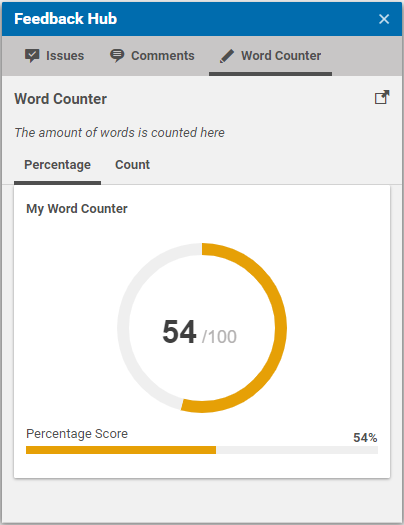

# Custom FeedbackItems

This section describes how to implement a custom `FeedbackItem`.
To keep the example simple, we created a new `FeedbackItem` that allows us 
to render text with a cursive font.

## Java Implementation

All you have to do, is to implement the interface `FeedbackItem` in terms of:

```java
public class CursiveTextFeedbackItem implements FeedbackItem {

  private String text;
  private String collection;

  public CursiveTextFeedbackItem(String collection, String text) {
    this.collection = collection;
    this.text = text;
  }
  
  public CursiveTextFeedbackItem(String text) {
    this(null, text);
  }

  public String getText() {
    return text;
  }

  @Override
  public String getCollection() {
    return collection;
  }

  @Override
  public String getType() {
    return "cursiveText";
  }
}
```

The interface does not require the implementation of any methods, but you can
override the `getType` method to have a simpler type name than the actual class name.
Also, you can provide the possibility to add the `FeedbackItem` to a specific collection
by overriding the `getCollection` method.

Within your provider or adapter, you can now create a new `CursiveTextFeedbackItem` 
with the text you want to render:

```java
CursiveTextFeedbackItem myItem = new CursiveTextFeedbackItem("header", 
  "The number of words is counted here");
```

To make this example more interesting, the text was added to the reserved collection `header`, 
which means that it will be rendered immediately after the title and before the sub tabs.

## AS/MXML Implementation

On the client site, you must implement the component that should render
the new `FeedbackItem` type.

First, you must implement a sub-component of the class `FeedbackItemPanel`:

```ts
class CursiveTextFeedbackItem extends FeedbackItemPanel {
  declare Config: CursiveTextFeedbackItemConfig;

  static override readonly xtype: string = "com.coremedia.cms.studio.feedbackhub.config.cursiveTextFeedbackItem";

  constructor(config: Config<CursiveTextFeedbackItem> = null) {
    super(ConfigUtils.apply(Config(CursiveTextFeedbackItem, {

      items: [
        Config(DisplayField, {
          ui: DisplayFieldSkin.ITALIC.getSkin(),
          value: config.feedbackItem["text"],
        }),
      ],
    }), config));
  }
}
```

Our example only contains a `DisplayField` which renders the `CursiveTextFeedbackItem` property `text`.
The `ITALIC` `DisplayFieldSkin` is applied to the label in order to render the text in _italic_.
We also use the `getLabel` function which checks if the given text is a key inside our resource bundle
and returns the localized label instead of using the original text.

We finally have to tell the Feedback Hub about this panel by using the `feedbackService` instance.
For this, we use the `initialize` method of our `FeedbackHubWordCounterStudioPlugin`:

```ts
class FeedbackHubWordCounterStudioPlugin extends StudioPlugin {
        declare Config: FeedbackHubWordCounterStudioPluginConfig;

        constructor(config: Config<FeedbackHubWordCounterStudioPlugin> = null) {
  super((()=>{
    this.#__initialize__(config);
    return ConfigUtils.apply(Config(FeedbackHubWordCounterStudioPlugin, {

    rules: [
    ],
  
    configuration: [
      new CopyResourceBundleProperties({
        destination: resourceManager.getResourceBundle(null, FeedbackHub_properties),
        source: resourceManager.getResourceBundle(null, FeedbackHubWordCounterStudioPlugin_properties),
      }),
    ],

  }), config);
  })());
  }

  #__initialize__(config: Config<FeedbackHubWordCounterStudioPlugin>): void {
    feedbackService._.registerFeedbackItemPanel("cursiveText", Config(CursiveTextFeedbackItem));
  }
}
```

Note that the value `cursiveText` matches the `getType` methods return value of `CursiveTextFeedbackItem.java`. For the provided example, the label 
would be rendered like this:



