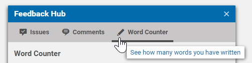
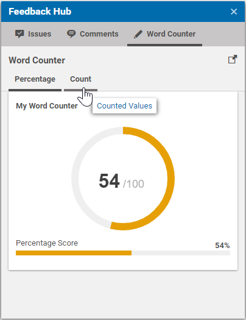

# Localization

When implementing a feedback source, an additional Studio Extension is required
to provide at least a resource bundle that is used to localize error messages and feedback labels.

Inside the `configuration` section the Studio plugin `FeedbackHubWordCounterStudioPlugin.ts`, copy your own resource bundle to the
`FeedbackHub` bundle: 

```ts
new CopyResourceBundleProperties({
  destination: resourceManager.getResourceBundle(null, FeedbackHub_properties),
  source: resourceManager.getResourceBundle(null, FeedbackHubWordCounterStudioPlugin_properties),
}),
```

## Main Tab Localization

For the localization of the main tab, you must use the `factoryId` of your adapter
or provider and append the suffixes `iconCls`, `title`, `tooltip` and `ariaLabel`
for the corresponding component attributes:

```json
wordCountProvider_iconCls: CoreIcons_properties.pencil,
wordCountProvider_title: "Word Counter",
wordCountProvider_tooltip: "See how many words you have written",
wordCountProvider_ariaLabel: "Word Counter",
```



You now have a custom icon and label for your Feedback source.


## Sub Tab Localization

When using tabbed feedback rendering, the localized labels for these tabs
can be provided in a similar way as for the main tab. The required format is
`<factoryId>_<collection>_tab_<labelType>`. Below you see an example that is 
used for the provider implementation:

```json
wordCountProvider_tab1_tab_title: "Percentage",
wordCountProvider_tab1_tab_tooltip: "Percentage Values",
wordCountProvider_tab1_tab_ariaLabel: "Percentage Values",

wordCountProvider_tab2_tab_title: "Count",
wordCountProvider_tab2_tab_tooltip: "Counted Values",
wordCountProvider_tab2_tab_ariaLabel: "Counted Values",
```

A localized provider looks like this:



## FeedbackItem Localization

For the labels and titles that are used for `FeedbackItems`, the Feedback
Hub will always try to look up the corresponding value from 
the `FeedbackHub_properties.ts` resource bundle.
For example, you can pass "word_count_label" as label value for the score bar: 

```java
ScoreBarFeedbackItem scoreBar = ScoreBarFeedbackItem.builder()
        .withValue(wordCount, settings.getTarget())
        .withLabel("word_count_label")
        .withCollection("tab2")
        .build();
```

Then, provide a localized value for this `string` within your 
`FeedbackHubWordCounterStudioPlugin_properties.ts` resource bundle.

```
word_count_label = Word Count
```

