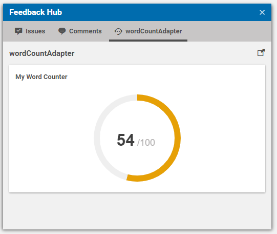

# Implementing a FeedbackAdapter 

In this tutorial we are gonna explain which steps are are required to 
implement you own _FeedbackAdapter_. The provider simply counts the amount of words
you have used inside your articles `detailText` field. 
For this we will implement the _TextFeedbackHubAdapter_ which already extracts
text from content. 




You can either clone this project and rename/refactor
the corresponding classes and methods or you can start from scratch with your own modules.
In any case, we assume that the `studio` and `studio-lib` modules have been setup properly.

## 1. Spring Configuration

Assuming you haven't already done it, create a `resource` folder inside your
`studio-lib` maven module with the corresponding `META-INF/spring.factories` file
which points to you Spring configuration class. In our example, this class is 
named `WordCounterConfiguration` and looks like this:

```java
@Configuration
public class WordCounterConfiguration {

  @Bean
  public WordCounterFeedbackAdapterFactory wordCounterFeedbackAdapterFactory() {
    return new WordCounterFeedbackAdapterFactory();
  }
}
``` 

The Spring configuration only created the `WordCounterFeedbackAdapterFactory`
which is responsible for creating the actual `FeedbackAdapter` instance.


## 3. FeedbackAdapter Implementation

We can now care about the actual feedback implementation.

```java
@DefaultAnnotation(NonNull.class)
public class WordCounterFeedbackAdapter implements TextFeedbackHubAdapter {
  private final WordCounterSettings settings;

  WordCounterFeedbackAdapter(WordCounterSettings settings) {
    this.settings = settings;
  }

  @Override
  public CompletionStage<Collection<FeedbackItem>> analyzeText(FeedbackContext context, Map<String, String> textProperties, @Nullable Locale locale) {
    String plainText = textProperties.values().stream().collect(Collectors.joining(" "));
    List<String> exclusions = Arrays.asList(settings.getIgnoreList().split(","));

    long wordCount = Stream.of(plainText.split(" ")).filter(f -> !exclusions.contains(f)).count();
    long percentage = wordCount * 100 / settings.getTarget();

    //create the external link button for the upper right corner
    FeedbackLinkFeedbackItem feedbackLink = FeedbackItemFactory.createFeedbackLink("https://github.com/CoreMedia/feedback-hub-adapter-tutorial");

    //create feedback
    GaugeFeedbackItem gauge = GaugeFeedbackItem.builder()
            .withValue(percentage)
            .withTitle("My Word Counter")
            .build();

    //check {@link WordCounterFeedbackProvider} for more examples

    //the items are rendered in the order they are passed here (except the feedbackLink which is always rendered at the top)
    return CompletableFuture.completedFuture(Arrays.asList(feedbackLink, gauge));
  }
}
```


We use the `TextFeedbackHubAdapter` which extracts the markup as plaintext from the content for us.
We then split the plaintext using whitespaces, but also
exclude the words that are inside the ignore list that has been passed 
as settings value.

The settings value _target_ determines
the amount of words our article should have and therefore can be used to 
calculate a percentage value how far the writing is progressed.


## 4. Configuration

We finally have to create a new _CMSettings_ document
in the site local or global "Feedback Hub" configuration folder. Below, you see
an example of a matching configuration created for the the Blueprint Site "Chef Corp.". 

```xml
<?xml version="1.0" encoding="UTF-8" ?>
<CMSettings folder="/Sites/Chef Corp./United States/English/Options/Settings/Feedback Hub" name="Wordcounter Adapter" xmlns:cmexport="http://www.coremedia.com/2012/cmexport">
  <externalRefId></externalRefId>
  <locale></locale>
  <master/>
  <settings><Struct xmlns="http://www.coremedia.com/2008/struct" xmlns:xlink="http://www.w3.org/1999/xlink">
    <StringProperty Name="observedProperties">detailText</StringProperty>
    <StringProperty Name="factoryId">wordCountAdapter</StringProperty>
    <StringProperty Name="groupId">wordCountAdapter</StringProperty>
    <StringProperty Name="contentType">CMArticle</StringProperty>
    <BooleanProperty Name="enabled">true</BooleanProperty>
    <StructProperty Name="settings">
      <Struct>
        <StringProperty Name="sourceProperties">detailText</StringProperty>
        <StringProperty Name="ignoreList">and,with</StringProperty>
        <IntProperty Name="target">1000</IntProperty>
      </Struct>
    </StructProperty>
  </Struct></settings>
  <identifier></identifier>
</CMSettings>
```

Note that in this implementation, the source property that is used to 
extract the markup is not hard coded like in the _FeedbackProvider_ example,
but can be set via settings parameter _sourceProperties_.

## 4. Exception Handling

The overall exception handling inside the Feedback Hub does not differ between
implementations of _FeedbackAdapter_ and _FeedbackProvider_. 
It is described in detail in section **[Exception Handling](exception_handling.md)**.
