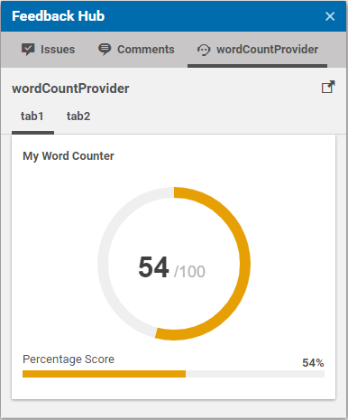
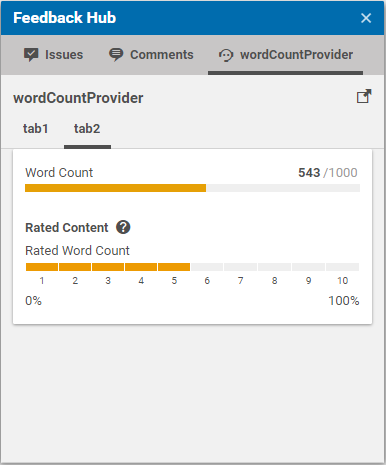
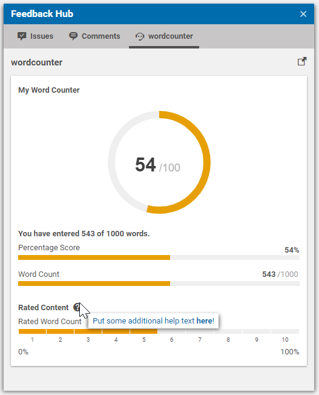

# Implementing a FeedbackProvider 

In this tutorial we are gonna explain which steps are required to 
implement you own `FeedbackProvider`. This provider will count the amount of words
you have used inside your articles `detailText` field. 

You can either clone this project and rename/refactor
the corresponding classes and methods or you can 
**[start from scratch by using archetypes](archetypes.md)**.
In any case, we assume that the `studio-server` and `studio-client` modules have been setup properly.

## 1. Spring Configuration

Assuming you haven't already done it, create a `resource` folder inside your
`studio-server` maven module with the corresponding `resources/plugin.properties` file
which points to you Spring configuration class. In our example, this class is 
named `WordCounterConfiguration` and looks like this:

```java
@Configuration
public class WordCounterConfiguration {

  @Bean
  public WordCounterFeedbackProviderFactory wordCounterFeedbackProviderFactory() {
    return new WordCounterFeedbackProviderFactory();
  }
}
``` 

The Spring configuration creates the `WordCounterFeedbackProviderFactory`
which is responsible for creating the actual `FeedbackProvider` instance.

## 2. FeedbackProviderFactory Implementation

Next, we take a closer look on the `WordCounterFeedbackProviderFactory`.

```java
public class WordCounterFeedbackProviderFactory implements FeedbackProviderFactory<WordCounterSettings> {

  @Override
  public String getId() {
    return "wordCountProvider";
  }

  @Override
  public FeedbackProvider create(WordCounterSettings settings) {
    return new WordCounterFeedbackProvider(settings);
  }
}
```

The class implements the interface `FeedbackProviderFactory` which requires
the implementation of the methods 

- `String getId()`: this methods return the unique id of this adapter and is used
to match the content based configuration against the actual implementation
- `FeedbackProvider create(T settings)`: this factory method creates the actual provider instance.
The settings interface that is passed here contains additional fields that may have been set
inside the `settings` struct of the adapter configuration. Usually credentials are passed
to the provider this way. In our example, we use this interface to pass additional 
configuration parameters:

```java
public interface WordCounterSettings {

  /**
   * Returns a comma separated list of words that are excluded from the word count.
   */
  String getIgnoreList();

  /**
   * Returns the amount of words the text should have.
   */
  Integer getTarget();
}
```


## 3. FeedbackProvider Implementation

Let's take a look on the actual feedback implementation:

```java
@DefaultAnnotation(NonNull.class)
public class WordCounterFeedbackProvider implements FeedbackProvider {
  private final WordCounterSettings settings;

  WordCounterFeedbackProvider(WordCounterSettings settings) {
    this.settings = settings;
  }

  @Override
  public CompletionStage<Collection<FeedbackItem>> provideFeedback(FeedbackContext feedbackContext) {
    Content content = (Content) feedbackContext.getEntity();

    //read text
    Markup markup = content.getMarkup("detailText");
    String plainText = MarkupUtil.asPlainText(markup);

    //calculate values
    List<String> exclusions = Arrays.asList(settings.getIgnoreList().split(","));

    //count words, exclude words from the ignore list
    long wordCount = Stream.of(plainText.split(" ")).filter(f -> !exclusions.contains(f)).count();
    long percentage = wordCount * 100 / settings.getTarget();

    //create the external link button for the upper right corner
    FeedbackLinkFeedbackItem feedbackLink = FeedbackItemFactory.createFeedbackLink("https://github.com/CoreMedia/feedback-hub-adapter-tutorial");

    //create feedback
    GaugeFeedbackItem gauge = GaugeFeedbackItem.builder()
            .withValue(percentage)
            .withTitle("My Word Counter")
            .build();

    //labels can be rendered bold and be therefore used as headline too
    LabelFeedbackItem label = LabelFeedbackItem.builder()
            .withBold()
            .withLabel("You have entered " + wordCount + " of " + settings.getTarget() + " words.")
            .build();

    //since we have a target value, we can also render a percentage bar
    PercentageBarFeedbackItem percentageScore = PercentageBarFeedbackItem.builder()
            .withValue(percentage)
            .withLabel("Percentage Score")
            .build();

    //a regular score bar with the target value as end value
    ScoreBarFeedbackItem scoreBar = ScoreBarFeedbackItem.builder()
            .withValue(wordCount, settings.getTarget())
            .withLabel("Word Count")
            .build();

    //we use the percentage as rating value here, just to show how this bar is used
    RatingBarFeedbackItem ratingBar = RatingBarFeedbackItem.builder()
            .withValue(Math.round(percentage) /10, 10)
            .withTitle("Rated Content")
            .withHelp("Put some additional help text <b>here</b>!")
            .withLabel("Rated Word Count")
            .withMinLabel("0%")
            .withMaxLabel("100%")
            .withReversedColors()
            .build();

    //the items are rendered in the order they are passed here (except the feedbackLink which is always rendered at the top)
    return CompletableFuture.completedFuture(Arrays.asList(feedbackLink, gauge, label, percentageScore, scoreBar, ratingBar));
  }

}
```

In this example, we extract the markup from the content,
convert it to plaintext and split the text using whitespaces. 
We also exclude the words that are inside the ignore list that has been passed 
as settings value.

For the feedback we use different redundant `FeedbackItems` here,
just to show what components are available. The settings value `target` determines
the amount of words our article should have and therefore can be used to 
calculate a percentage value of how far the writing is progressed.

## 4. Feedback Grouping

The Feedback Hub supports the tabbed rendering of `FeedbackItems`.
All you have to do is to use the `withCollection` method which is supported 
by most `FeedbackItemBuilders`.
For example, we could render the percentage based `FeedbackItems` on one tab
and the number based scores on another by adding `.withCollection("tab1")` and
`.withCollection("tab2")` to the corresponding builders. The result would look like this:






## 5. Configuration

We finally have to create a new `CMSettings` document
within a site or within the global "Feedback Hub" configuration folder. Below, you see
an example configuration created for the Blueprint Site "Chef Corp.". 

```xml
<?xml version="1.0" encoding="UTF-8" ?>
<CMSettings folder="/Sites/Chef Corp./United States/English/Options/Settings/Feedback Hub" name="Wordcounter Provider" xmlns:cmexport="http://www.coremedia.com/2012/cmexport">
  <externalRefId></externalRefId>
  <locale></locale>
  <master/>
  <settings><Struct xmlns="http://www.coremedia.com/2008/struct" xmlns:xlink="http://www.w3.org/1999/xlink">
    <StringProperty Name="observedProperties">detailText</StringProperty>
    <StringProperty Name="factoryId">wordCountProvider</StringProperty>
    <StringProperty Name="groupId">wordCountProvider</StringProperty>
    <StringProperty Name="contentType">CMArticle</StringProperty>
    <BooleanProperty Name="enabled">true</BooleanProperty>
    <StructProperty Name="settings">
      <Struct>
        <StringProperty Name="ignoreList">and,with</StringProperty>
        <IntProperty Name="target">1000</IntProperty>
      </Struct>
    </StructProperty>
  </Struct></settings>
  <identifier></identifier>
</CMSettings>
```

If everything is configured properly, the Feedback Hub window will have
an additional tab with your Feedback Hub provider:



## 6. Localization

The localization of the Feedback Hub does not differ between
implementations of `FeedbackAdapter` and `FeedbackProvider`. 
It is described in detail in section **[Localization](feedback_localization.md)**.

## 7. Exception Handling

The overall exception handling inside the Feedback Hub does not differ between
implementations of `FeedbackAdapter` and `FeedbackProvider`. 
It is described in detail in section **[Error Handling](error_handling.md)**.

## 8. Custom FeedbackItems

If the existing `FeedbackItems` are not sufficient to render the desired feedback,
you can implement custom `FeedbackItems`.
An example for this is described in section **[Custom FeedbackItems](custom_feedback.md)**.

## 9. Jobs Framework

In some situations it is desired to support user interaction, e.g. via buttons 
on custom Feedback panels, which should trigger actions on the server.
The recommended way to do this, is using the Studio's jobs framework. 

An example for this is described in section **[Jobs Framework](jobs_framework.md)**.
