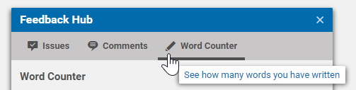
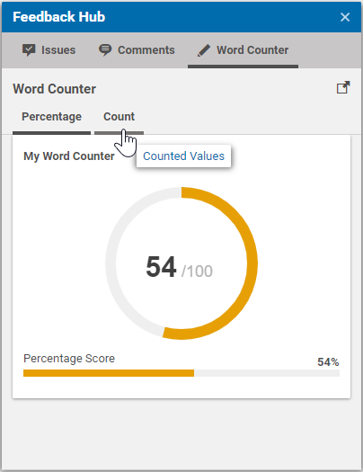

# Localization

When implementing a feedback source, an additional Studio Extension is required
to provide at least a resource bundle that is used to localize error messages and feedback labels.

Inside our Studio plugin `FeedbackHubWordCounterStudioPlugin.mxml`, we copy our own resource bundle to the
`com.coremedia.cms.studio.feedbackhub.FeedbackHub` bundle: 

```xml
<editor:configuration>
  <editor:CopyResourceBundleProperties
        destination="{ResourceManager.getInstance().getResourceBundle(null, 
            'com.coremedia.cms.studio.feedbackhub.FeedbackHub')}"
        source="{ResourceManager.getInstance().getResourceBundle(null, 
            'com.coremedia.blueprint.studio.feedback.wordcounter.FeedbackHubWordCounterStudioPlugin')}"/>
</editor:configuration>
```

## Main Tab Localization

For the localization of the main tab, we use the `factoryId` of our adapter
or provider and append the suffixes `iconCls`, `title`, `tooltip` and `ariaLabel`
for the corresponding component attributes:

```
wordCountProvider_iconCls=Resource(key='pencil', bundle='com.coremedia.icons.CoreIcons')
wordCountProvider_title=Word Counter
wordCountProvider_tooltip=See how many words you have written
wordCountProvider_ariaLabel=Word Counter
```



We now have a custom icon and label for our Feedback source.


## Sub Tab Localization

When using tabbed feedback rendering, the localized labels for these tabs
can be provided in a similar way as for the main tab. The required format is
`<factoryId>_<collection>_tab_<labelType>`. Below you see an example that is 
used for the provider implementation:

```
wordCountProvider_tab1_tab_title = Percentage
wordCountProvider_tab1_tab_tooltip = Percentage Values 
wordCountProvider_tab1_tab_ariaLabel = Percentage Values

wordCountProvider_tab2_tab_title = Count
wordCountProvider_tab2_tab_tooltip = Counted Values 
wordCountProvider_tab2_tab_ariaLabel = Counted Values
```

The localized provider would look like this:



## FeedbackItem Localization

For the labels and titles that are used for `FeedbackItems`, the Feedback
Hub will always try to look up the corresponding value from 
the `com.coremedia.cms.studio.feedbackhub.FeedbackHub` resource bundle.
For example, we can pass "word_count_label" as label value for the score bar: 

```java
ScoreBarFeedbackItem scoreBar = ScoreBarFeedbackItem.builder()
        .withValue(wordCount, settings.getTarget())
        .withLabel("word_count_label")
        .withCollection("tab2")
        .build();
```

Then we provide a localized value for this `String` within our 
`com.coremedia.blueprint.studio.feedback.wordcounter.FeedbackHubWordCounterStudioPlugin` resource bundle.

```
word_count_label = Word Count
```

