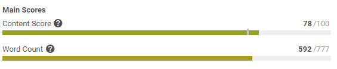
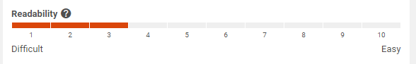
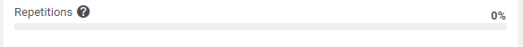
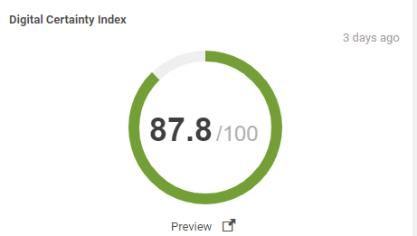
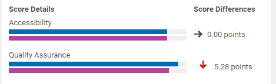
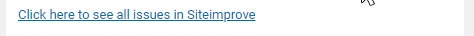
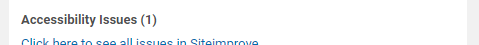

# Predefined FeedbackItems

This section shows an overview of existing components for `FeedbackItem`.
These can be used when implementing your own feedback adapter or provider.

### Score Bar

__Builder Class:__ ScoreBarFeedbackItemBuilder

| Property          | Type     | Default Value | Description |
| ----------------- | :------: | :------------: |------------ |
| collection        | String   | -      | The tab the panel should be rendered too. |
| title             | String   | -      | The title of the panel. |
| help              | String   | -      | The help text to be rendered as tooltip for a help icon. |
| label             | String   | -      | The label that is shown above the bar. |
| value             | float    | 0      | The value of the score. |
| maxValue          | float    | 100    | The maximum value of the score. |
| targetValue       | float    | -1     | The value to achieve. If set, a marker will be rendered on the score bar. |
| reverseColors     | boolean  | -      | If true, the color will go from green to red. |
| decimalPlaces     | int      | 0      | The number of decimal places. |
| color             | String   | -      | If set, the whole bar will be rendered with this color. The _reverseColors_ attribute is ignored in this case. |

### Rating Score Bar

__Builder Class:__ RatingBarFeedbackItemBuilder

| Property          | Type     | Default Value | Description |
| ----------------- | :------: | :------------: |------------ |
| collection        | String   | -      | The tab the panel should be rendered too. |
| title             | String   | -      | The title of the panel. |
| help              | String   | -      | The help text to be rendered as tooltip for a help icon. |
| label             | String   | -      | The label that is shown above the bar. |
| value             | float    | 0      | The value of the score. |
| maxValue          | float    | 100    | The maximum value of the score. |
| reverseColors     | boolean  | -      | If true, the color will go from green to red. |
| color             | String   | -      | If set, the whole bar will be rendered with this color. The _reverseColors_ attribute is ignored in this case. |
| minLabel          | String   | -      | The label to render at the beginning of the score bar. |
| maxLabel          | String   | -      | The label to render at the end of the score bar. |

### Percentage Score Bar

__Builder Class:__ PercentageBarFeedbackItemBuilder

| Property          | Type     | Default Value | Description |
| ----------------- | :------: | :------------: |------------ |
| collection        | String   | -      | The tab the panel should be rendered too. |
| title             | String   | -      | The title of the panel. |
| help              | String   | -      | The help text to be rendered as tooltip for a help icon. |
| label             | String   | -      | The label that is shown above the bar. |
| value             | float    | 0      | The value of the score. |
| color             | String   | -      | If set, the whole bar will be rendered with this color. The _reverseColors_ attribute is ignored in this case. |
| reverseColors     | boolean  | -      | If true, the color will go from green to red. |
| decimalPlaces     | int      | 0      | The number of decimal places. |

### Gauge Bar

__Builder Class:__ GaugeFeedbackItemBuilder

| Property          | Type     | Default Value | Description |
| ----------------- | :------: | :------------: |------------ |
| collection        | String   | -      | The tab the panel should be rendered too. |
| title             | String   | -      | The title of the panel. |
| help              | String   | -      | The help text to be rendered as tooltip for a help icon. |
| label             | String   | -      | The label that is shown above the bar. |
| value             | float    | 0      | The value of the score. |
| targetValue       | float    | -1     | The value to achieve. If set, a marker will be rendered on the score bar. |
| gaugeTitle        | String   | -      | The title that is shown below the gauge. |
| linkTarget        | String   | -      | If set, an external link button will be rendered behind the gauge title. |
| age               | long     | 0      | The last time the data of this gauge was fetched, milliseconds from 1970. |
| color             | String   | -      | If set, the whole bar will be rendered with this color. The _reverseColors_ attribute is ignored in this case. |
| reverseColors     | boolean  | -      | If true, the color will go from green to red. |
| decimalPlaces     | int      | 0      | The number of decimal places. |

### Comparing Score Bar

__Builder Class:__ ComparingScoreBarFeedbackItemBuilder

| Property          | Type     | Default Value | Description |
| ----------------- | :------: | :------------: |------------ |
| collection        | String   | -      | The tab the panel should be rendered too. |
| title             | String   | -      | The title of the panel. |
| help              | String   | -      | The help text to be rendered as tooltip for a help icon. |
| label             | String   | -      | The label that is shown above the bar. |
| reverseColors     | boolean  | -      | If true, the color will go from green to red. |
| unitLabel         | String   | -      | The unit string the difference is measured in. |
| unitTitle         | String   | -      | The bold title of the right column. |
| barTitle          | String   | -      | The bold title of the left column. |
| decimalPlaces     | int      | 0      | The number of decimal places. |
| value1            | float    | 0      | The value of the 1st score bar. |
| maxValue1         | float    | -      | The maximum value of the 1st score bar. |
| targetValue1      | float    | -      | The target value of the 1st score bar. |
| color1            | String   | -      | The color the 1st score bar should be rendered with. If set, the _reverseColor_ attribute will be ignored. |
| value2            | float    | 0      | The value of the 2nd score bar. |
| maxValue2         | float    | -      | The maximum value of the 2nd score bar. |
| targetValue2      | float    | -      | The target value of the 2nd score bar. |
| color2            | String   | -      | The color the 2nd score bar should be rendered with. If set, the _reverseColor_ attribute will be ignored. |

### External Link

__Builder Class:__ ExternalLinkFeedbackItemBuilder

| Property          | Type     | Default Value | Description |
| ----------------- | :------: | :------------: |------------ |
| collection        | String   | -      | The tab the panel should be rendered too. |
| title             | String   | -      | The title of the panel. |
| url               | String   | -      | The URL of the link. |
| linkText          | String   | -      | The link label. |

### Label

__Builder Class:__ LabelFeedbackItemBuilder

| Property          | Type     | Default Value | Description |
| ----------------- | :------: | :------------: |------------ |
| collection        | String   | -      | The tab the panel should be rendered too. |
| bold              | boolean  | -      | Set to true to render a bold label. |
| text              | String   | -      | The text of the label. |
| args              | Array    | -      | Optional params to parameterize the label. |

### Empty Panel

This panel is only used for creating empty tabs in case the feedback is not available during the first rendering.
In general, they are only used internally but can be created through the _FeedbackItemFactory_.

| Property          | Type     | Default Value | Description |
| ----------------- | :------: | :------------: |------------ |
| collection        | String   | -      | The tab the panel should be rendered too. |
